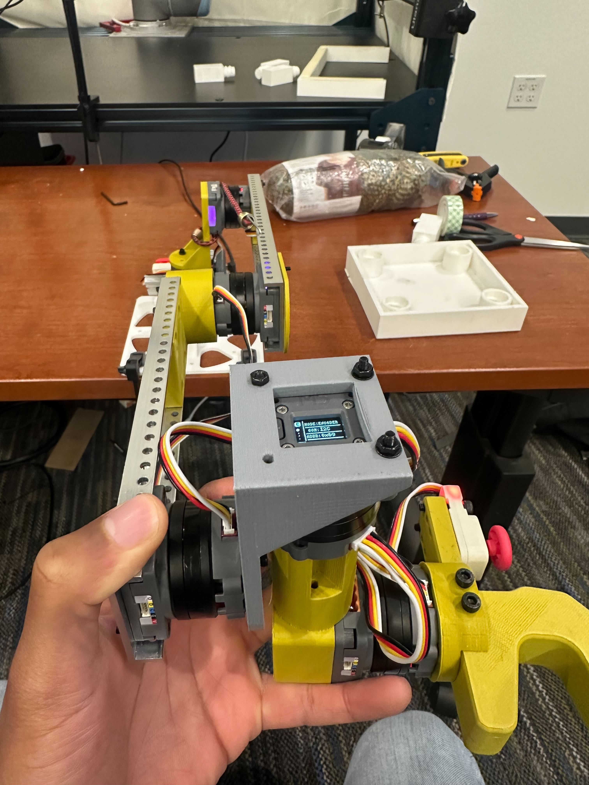
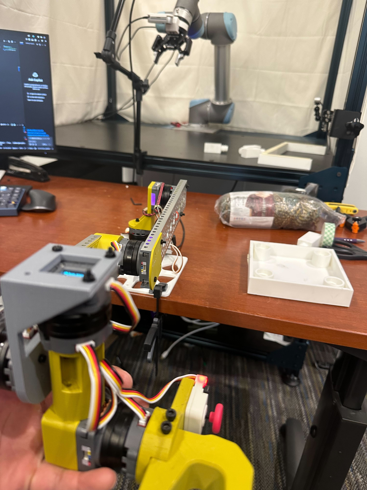
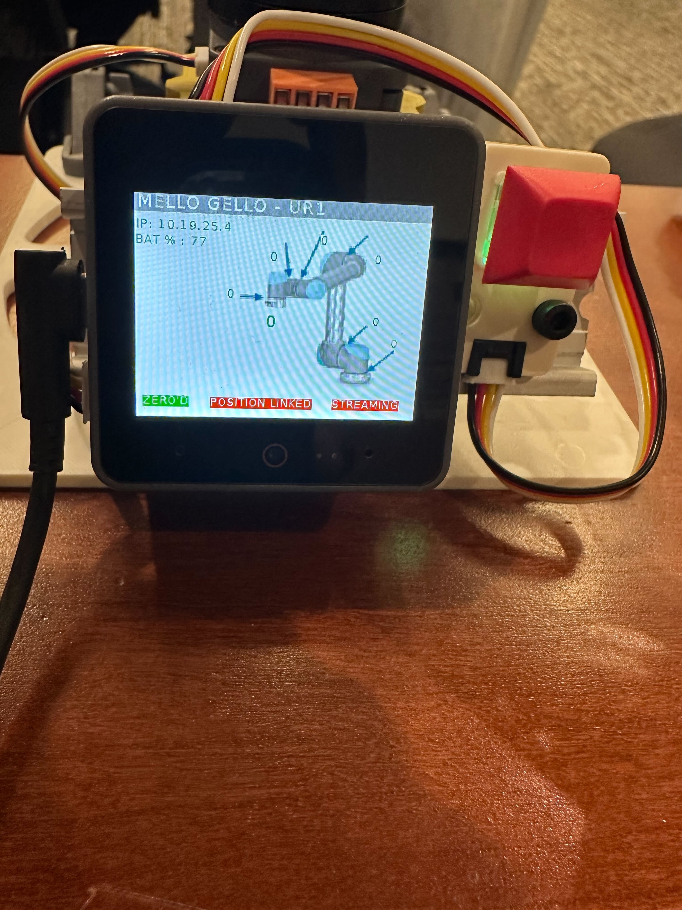
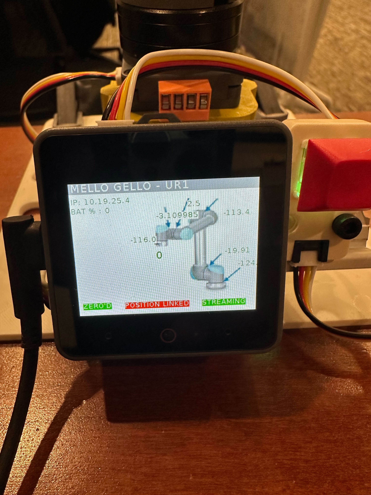

# Teleop Setup Guide

## Overview
This guide covers the setup and usage of teleoperation for the robot arm using the Mello controller.

For hardware setup, refer to the [Mello Hardware Setup Guide](https://github.com/emmarUW/mello_gello).
For firmware setup, refer to the [Mello Firmware Setup Guide](/firmware/README.md).

## Mello Controller Setup

### 1. Calibrate Mello

1. Place Mello in the calibration position as shown in the images below
2. While holding it in this position, press and hold the red button for a few seconds




**Calibration Complete**: The ZERO indicator on the screen will turn green when calibration is successful.



### 2. Stream Joint Positions from Mello

1. **Unlock USB permissions**:
   ```bash
   sudo chmod 777 /dev/serial/by-id/usb-M5Stack_Technology_Co.__Ltd_M5Stack_UiFlow_2.0_24587ce945900000-if00
   ```

2. **Start streaming**: Double-tap the red button to begin streaming joint positions. The streaming indicator on the screen will turn green.



3. **Test the connection**:
   ```bash
   python tests/test_mello.py
   ```
   You should see joint positions being streamed in real-time.
