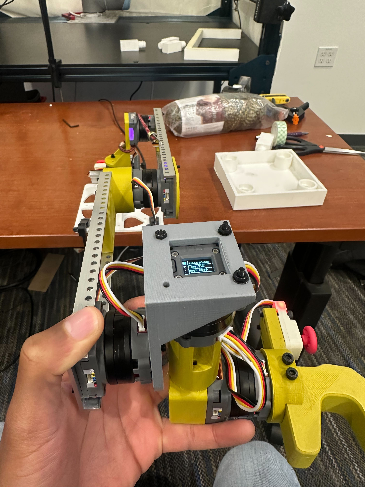
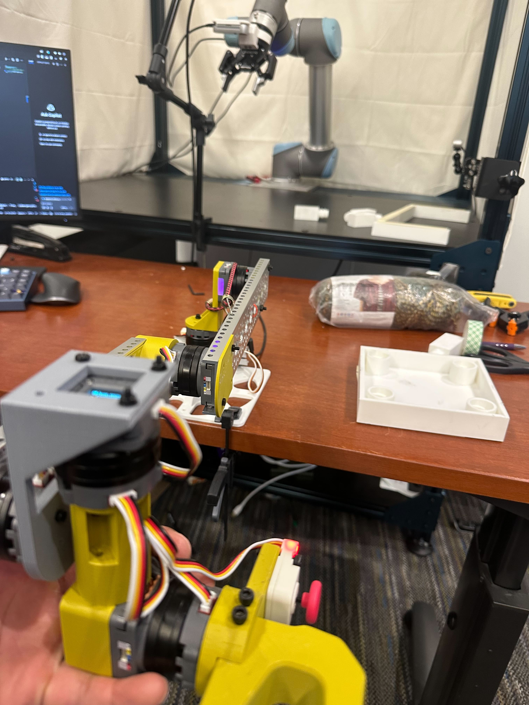
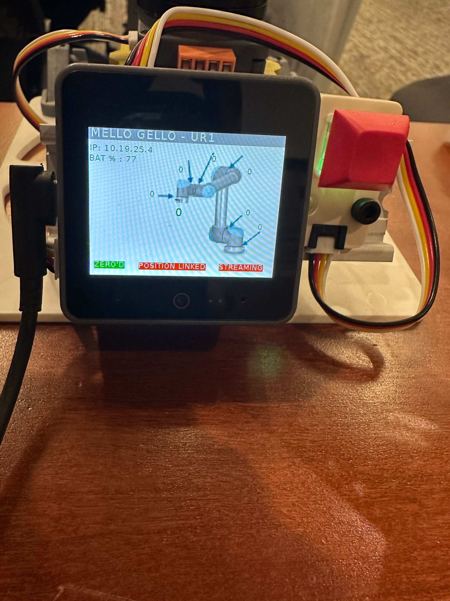
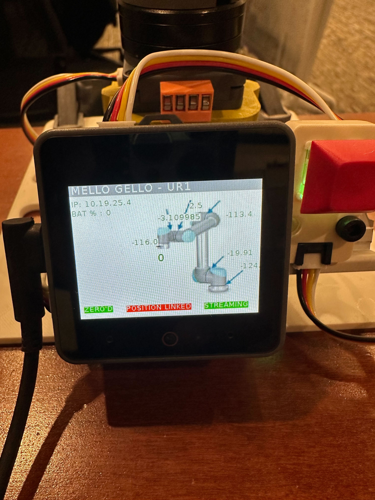

# Teleop Setup Guide

## Overview
This guide covers the setup and usage of teleoperation for the robot arm using the Mello controller.

For hardware setup, refer to the [Mello Hardware Setup Guide](https://github.com/emmarUW/mello_gello).
For firmware setup, refer to the [Mello Firmware Setup Guide](/firmware/README.md).

## VS Code Workflow (Recommended)

This repository now includes a VS Code-based deploy workflow so users can update firmware without relying on the UiFlow project upload flow for day-to-day changes.

### One-time host setup

1. Select a Python interpreter in VS Code (prefer a workspace virtual environment).
2. Run task: `Mello: Install Host Dependencies`.

### Daily workflow

1. Run task: `Mello: Deploy Firmware`.
2. Run task: `Mello: Serial Monitor`.

Optional tasks:

- `Mello: Deploy Firmware (With Secrets)` uploads local Wi-Fi secrets.
- `Mello: List Serial Ports` prints detected COM/TTY devices.
- `Mello: Reboot Device` sends a soft reset via mpremote.

## Important: Serial Output Is Binary During Streaming

When streaming is enabled on the controller, firmware sends binary packets to stdout for the host decoder. In a plain serial terminal this appears as garbled/random characters. This is expected and does not indicate broken firmware. THIS IS A CHANGE FROM EARLY MELLOGELLO IMPLEMENTATIONS.

Use the host decoder (`mellogello/mello_teleop.py`) to parse the stream.

## Mello Controller Setup

### 1. Calibrate Mello

1. Place Mello in the calibration position as shown in the images below
2. While holding it in this position, press and hold the red button for a few seconds




**Calibration Complete**: The ZERO indicator on the screen will turn green when calibration is successful.



### 2. Stream Joint Positions from Mello

1. **Unlock USB permissions**:
   ```bash
   sudo chmod 777 /dev/serial/by-id/usb-M5Stack_Technology_Co.__Ltd_M5Stack_UiFlow_2.0_24587ce945900000-if00
   ```

2. **Start streaming**: Double-tap the red button to begin streaming joint positions. The streaming indicator on the screen will turn green.



3. **Test the connection**:
   ```bash
   python tests/test_mello.py
   ```
   You should see joint positions being streamed in real-time.
